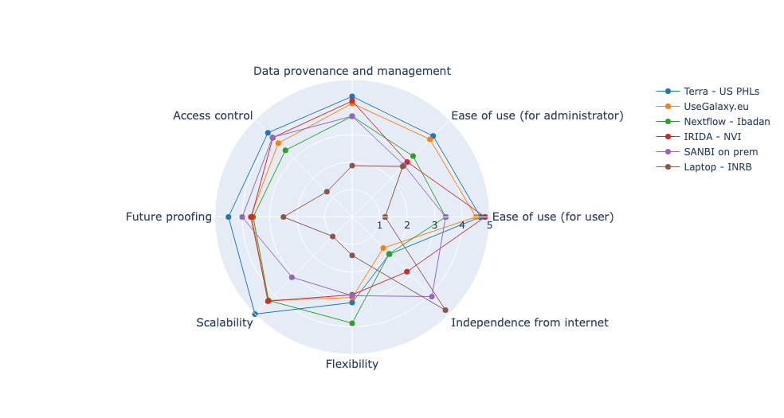

# Framework for Compute Infrastructure for Pathogen Genomics Labs

**PHA4GE Infrastructure Working Group  **
Authors (order TBD): Karin Lagesen, Kim Lee Ng, Nabil-Fareed Alikhan, Soyean Kim, Joel Sevinsky, Kelsey Florek, Anthony Underwood, Thomas R Connor, Suresh Maslamoney, Peter van Heusden, Daniel Park

Affiliations (order TBD):
1. [KL] Norwegian Veterinary Institute, Ås, Norway;
1. [KN] Bioinformatics and Sequencing, Statens Serum Institut, Copenhagen, Denmark;
1. [NFA] Centre for Genomic Pathogen Surveillance, Pandemic Sciences Institute, University of Oxford, UK;
1. [SK] Faculty of Health Sciences, Simon Fraser University, Canada;
1. [JS] Theiagen Genomics, USA;
1. [KF] Wisconsin State Laboratory of Hygiene, Madison, WI, USA;
1. [AU –- update] Centre for Genomic Pathogen Surveillance, Big Data Institute, Li Ka Shing Centre for Health Information and Discovery, Nuffield Department of Medicine, University of Oxford, UK;
1. [TRC] Public Health Wales NHS Trust, 2 Capital Quarter, Tyndall St, Cardiff CF10 4BZ and University of Cardiff, Sir Martin Evans Building, Museum Avenue, Cardiff, CF10 3AX;
1. [SM] Computational Biology Division, Department of Integrative Biomedical Sciences, Institute of Infectious Disease and Molecular Medicine, University of Cape Town, Cape Town, South Africa;
1. [PvH] South African Medical Research Council Bioinformatics Unit, South African National Bioinformatics Institute, University of the Western Cape, Bellville, South Africa;
1. [DP] Infectious Disease and Microbiome Program, Broad Institute of MIT and Harvard, MA, USA;

ORCIDs? (good idea but probably depends on journal)
 - KL: 0000-0003-1329-9032
 - KN: 0000-0002-2679-8845
 - TRC: 0000-0003-2394-6504
 - NFA: 0000-0002-1243-0767
 - DP: 0000-0001-7226-7781

 
 Document Changelog

- 2024-12-19:
    - DP & KN work session
- 2024-12-13:
    - DP & KN work session. python notebook and data moved to github.
- 2024-11-20:
    - DP & KN work session
- 2024-11-13:
    - DP & KN work session
- 2024-01-30:
    - Move to github MD from gdoc
- 2024-04-12:
    - DP & KN more work and formatting
- 2024-07-03:
    - DP & KN more work and clean up and restructuring
- 2024-07-10:
    - DP & KN more work and clean up
- 2024-07-17:
    - DP & KN more work and clean up and restructuring and filling out

## Abstract

With climate change, habitat disruptions, an increase of antibiotic resistance and other anthropogenic and natural factors, combating infections both in humans and animals is again coming to the forefront. Sequencing technology has become an increasingly important part of the toolkit to track and characterise pathogens, and the use of pathogen genomic data in public health is growing. However, sequencing technologies have the potential to generate significant volumes of data, and this requires data management, analysis methods and interpretation tools that might be unfamiliar for the institutions tasked with this work. Here, the PHA4GE Infrastructure working group, consisting of practising bioinformaticians from both academia and healthcare/public health, present a set of recommendations on how institutions can manage this new technology in order to get full use of the data. These recommendations cover aspects including infrastructure, data management, analysis workflow tools and user management. In addition, non-technical considerations, such as legacy systems and regulatory factors are discussed. With these recommendations, the working group aims to provide institutions and working bioinformaticians with a set of best practice guidelines to guide decision making around computational environments used to employ sequencing data to combat disease.

## Background and Motivation

Whole genome sequencing of pathogens has now matured, offering improved methods to public health and clinical microbiology. An increasing number of public health institutions[^Black2020] have adopted genome sequencing as standard practice, and the use of genomics for characterising some pathogens, such as Mycobacterium tuberculosis, is now the gold standard for patient management. Globally, significant large-scale sequencing efforts have bridged the Public Health and Research domains, including for gastrointestinal pathogens (GenomeTrakr) and, most recently, its use over the course of the COVID-19 pandemic[^CDC2020][^COGUK2020][^Ribot2019]. However, the large volumes of data that are generated through the routine use of sequencing technologies, required for analysis, disrupts existing central or enterprise information technology (CIT) infrastructure.  The adoption of genomics within public health organisations  requires an understanding of many of the challenges that have been faced by research computing[^Nadon2017]. Interpreting analyses based on genome sequencing (requiring microbiological domain knowledge) and understanding the underlying computing infrastructure requirements (requiring domain knowledge of performance computing and storage) is technically challenging and a skill set that is in need of development in public health institutes. Furthermore, genomic data generated by public health organisations are used to produce analysis results that  inform government policy and regulation. In outbreak or pandemic situations, this analysis needs to happen quickly, while in all circumstances the use of the data demands robustness and data provenance beyond that which is provided by most pre-existing software tools for genome analysis. Moving forward, it is likely that investments in pathogen genomics at a government level will sit alongside investments in clinical human genomics. Therefore, understanding the computational, infrastructure and analysis requirements for pathogen genomic data will be vital in informing the strategic development of genomics-focused infrastructure more generally.

[^Black2020]: Black, Allison, Duncan R. MacCannell, Thomas R. Sibley, and Trevor Bedford. 2020. ‘Ten Recommendations for Supporting Open Pathogen Genomic Analysis in Public Health’. Nature Medicine 26 (6): 832–41. https://doi.org/10.1038/s41591-020-0935-z
[^CDC2020]: CDC 2020. ‘Cases, Data, and Surveillance’. Centers for Disease Control and Prevention. 11 February 2020. https://www.cdc.gov/coronavirus/2019-ncov/variants/spheres.html
[^COGUK2020]: COGUK 2020. ‘An Integrated National Scale SARS-CoV-2 Genomic Surveillance Network’. The Lancet. Microbe 1 (3): e99–100. https://doi.org/10.1016/S2666-5247(20)30054-9
[^Ribot2019]: Ribot, Efrain M., Molly Freeman, Kelley B. Hise, and Peter Gerner-Smidt. 2019. ‘PulseNet: Entering the Age of Next-Generation Sequencing’. Foodborne Pathogens and Disease 16 (7): 451–56. https://doi.org/10.1089/fpd.2019.2634
[^Nadon2017]: Nadon, Celine, Ivo Van Walle, Peter Gerner-Smidt, Josefina Campos, Isabel Chinen, Jeniffer Concepcion-Acevedo, Brent Gilpin, et al. 2017. ‘PulseNet International: Vision for the Implementation of Whole Genome Sequencing (WGS) for Global Food-Borne Disease Surveillance’. Eurosurveillance 22 (23): 30544. https://doi.org/10.2807/1560-7917.ES.2017.22.23.30544

Here, we present a description of considerations required in designing computing infrastructure that will cater to the requirements of common pathogen genome analysis pipelines. We also present  an assessment of benefits and limitations of existing solutions utilising on premises hardware or cloud-backed computing resources. 

## Five factors for bioinformatics infrastructure

Developing computing infrastructure depends on a number of considerations, many of which have been covered elsewhere[^Ahmed2021][^Glatard2017][^Nicholls2021][^Oakeson2017][^Maljkovic2019][^Parkhill2010][^Raza2016] too numerous to address completely. Here we will focus on computing infrastructure as it serves as a platform for running pathogen genomic analyses. We summarise this into five primary questions that pathogen genomics labs must address, and by which we next will use to frame our recommendations for compute infrastructure. Note, the main target for these recommendations is the institutional provider of pathogen bioinformatics services, commonly a sysadmin team, in addition to the practicing biology end-user.

[^Ahmed2021]: Ahmed AE, Allen JM, Bhat T, Burra P, Fliege CE, Hart SN, et al. Design considerations for workflow management systems use in production genomics research and the clinic. Sci Rep. 2021;11: 21680. https://doi.org/10.1038/s41598-021-99288-8
[^Glatard2017]: Glatard T, Rousseau M-É, Camarasu-Pop S, Adalat R, Beck N, Das S, et al. Software architectures to integrate workflow engines in science gateways. Future Gener Comput Syst. 2017;75: 239–255. https://doi.org/10.1016/j.future.2017.01.005
[^Nicholls2021]: Nicholls SM, Poplawski R, Bull MJ, Underwood A, Chapman M, Abu-Dahab K, et al. CLIMB-COVID: continuous integration supporting decentralised sequencing for SARS-CoV-2 genomic surveillance. Genome Biol. 2021;22: 196. https://doi.org/10.1186/s13059-021-02395-y
[^Oakeson2017]: Oakeson KF, Wagner JM, Mendenhall M, Rohrwasser A, Atkinson-Dunn R. Bioinformatic Analyses of Whole-Genome Sequence Data in a Public Health Laboratory. Emerg Infect Dis. 2017;23: 1441–1445. https://doi.org/10.3201/eid2309.170416
[^Maljkovic2019]: Maljkovic Berry I, Melendrez MC, Bishop-Lilly KA, Rutvisuttinunt W, Pollett S, Talundzic E, et al. Next Generation Sequencing and Bioinformatics Methodologies for Infectious Disease Research and Public Health: Approaches, Applications, and Considerations for Development of Laboratory Capacity. J Infect Dis. 2019. https://doi.org/10.1093/infdis/jiz286
[^Parkhill2010]: Parkhill J, Birney E, Kersey P. Genomic information infrastructure after the deluge. Genome Biol. 2010. Available: http://genomebiology.com/content/11/7/402
[^Raza2016]: Raza S, Luheshi L. Big data or bust: realizing the microbial genomics revolution. Microb Genom. 2016;2: e000046. https://doi.org/10.1099/mgen.0.000046

These factors are described from the perspective of a reasonably seasoned systems administrator (here, the 'admins user', as opposed to the end user, the more biologically inclined biologist. 

  **How much does the infrastructure try and solve:** which parts of the pathogen bioinformatics analysis solution do you want to be responsible for?

  **How the analysis is run:** The management of analytics workflows or “bioinformatic pipelines.” These might be implemented as a series of command-line scripts or more formal containerised workflow managers (e.g. Snakemake, NextFlow, Workflow Description Language). This will determine the level to which analyses are usable, reusable, portable and reproducible.

  **Where the analysis is run:** The physical infrastructure, hardware components and the degree of abstraction for the user. For instance, analyses may run on a laptop, a server, a high performance computing (HPC) cluster, or remotely on cloud compute resources. This will determine the scale at which the analyses can be run and the degree of abstraction for the user.

  **How data flows:** Where data comes from, where it is stored during analysis and where it goes. This includes how data is archived and presented (via dashboards, reporting, etc).

  **Who has access:** This encompasses identity and access management, and includes how users are authenticated and authorised to access data. This can be managed by associating users with organisations, projects, and roles. Common defined roles include end users and those with elevated permissions to assist with administration and support.

It should however be noted that many implementations are motivated by institutionally-specific factors outside of these five considerations. Not infrequently an organization will for instance have to decide if they will set up an entirely new infrastructure to handle their needs, or if a pre-existing infrastructure will be used. There might be strong incentives or even rules that dictate that pre-existing solutions should be used. However, how this infrastructure will scale and how future-proof that solution will be (regarding sample volume, finances, regulatory issues, etc) should be taken into account. In such a situation, it is advisable to evaluate and describe the appropriateness of this solution before committing to it, to avoid any potential sunk cost fallacy situations.

### How much does the infrastructure try and solve: Layers of concern

There are a multitude of options for bioinformatic computing infrastructure deployment. The best solution will depend on the specific constraints imposed on a laboratory by their Central IT, Procurement, and other institutional entities. It is important to be aware of the range of solutions available (and unavailable) to make an informed decision. These solutions can be categorised by their degree of abstraction, i.e. the amount of infrastructure that is managed by the user or is deferred to others (Figure 1). Most solutions will belong to one of three major tiers, with SaaS representing the higher abstraction/deferred tier, and IaaS the lowest abstraction/deferred tier: 

 - **Software as a Service (SaaS)** - User brings data. Controlled set of pipelines made available to users. All hardware resources and data are managed by others.
 - **Platform as a Service (PaaS)** - User brings data and pipelines. All hardware resources and data are managed by others.
 - **Infrastructure as a Service (IaaS)** - User brings data, pipelines, operating system around pipeline execution and management software. While IaaS is often associated with cloud-hosted virtual machines, we are using the term here to describe all configurations that are fully configured by the user.

Note that the abstraction level is independent of where the physical location of the compute resources are.

**Figure 1: Scope of Responsibility** - the scope of what different solutions attempt to solve for the users and admins. All infrastructure components (bottom of figure) need to be addressed by some combination of the end-user, system admins, or an external party. The degree to which responsibility can be deferred to a third party depends on the solution chosen. For example, on the IaaS level, a research group will also need to provide their own solution for orchestrating infrastructure (including software installation, selecting and installing a pipeline executor and installing pipelines), which would be solved via SaaS. Thus, selecting a lower level of abstraction introduces additional flexibility with the burden of additional complexity for the users.

### How the analysis is run: Managing bioinformatic compute workflows

There is a minimum requirement of transparency and portability associated with public health protocols that transfers to genome analysis. In order to meet these requirements genome analysis should be run through containerised bioinformatic pipelines expressed in a bioinformatic workflow language [^Ahmed2021][^PipesVizSC2] (Figure 2).

[^PipesVizSC2]: PHA4GE Pipelines and Visualisations Working Group. Bioinformatics Solutions For SARS-CoV-2 Genomic Analysis. https://pha4ge.org/resource/bioinformatics-solutions-for-sars-cov-2-genomic-analysis/

The specific workflow managers and workflow languages are continually evolving, but the resources mentioned above include WDL (Workflow Description Language)[^WDL], CWL (Common Workflow Language)[^CWL], Nextflow[^DiTommaso2017], and Galaxy[^Galaxy]. These languages have varying degrees of adoption and support in APIs and services defined by the Global Alliance for Genomics and Health ([GA4GH](https://www.ga4gh.org/genomic-data-toolkit/)). Labs may employ other workflow languages, such as Snakemake, Airflow, or Swift—these also allow for reproducible and replicable workflows, but may not be as portable in a genomics pipeline sharing ecosystem.

[^WDL]: The OpenWDL Consortium. Workflow Description Language (WDL). 2012. OpenWDL. https://github.com/openwdl/wdl
[^CWL]: Crusoe, Michael R., Sanne Abeln, Alexandru Iosup, Peter Amstutz, John Chilton, Nebojša Tijanić, Hervé Ménager, Stian Soiland-Reyes, Carole Goble, and The CWL Community. 2014. Methods Included: Standardizing Computational Reuse and Portability with the Common Workflow Language. Common Workflow Language. https://github.com/common-workflow-language/common-workflow-language
[^DiTommaso2017]: Di Tommaso, Paolo, Maria Chatzou, Evan W. Floden, Pablo Prieto Barja, Emilio Palumbo, and Cedric Notredame. 2017. Nextflow Enables Reproducible Computational Workflows. Nature Biotechnology 35 (4): 316–19. https://doi.org/10.1038/nbt.3820
[^Galaxy]: The Galaxy Community, Enis Afgan, Anton Nekrutenko, Bjórn A Grüning, Daniel Blankenberg, Jeremy Goecks, Michael C Schatz, et al. 2022. The Galaxy Platform for Accessible, Reproducible and Collaborative Biomedical Analyses: 2022 Update. Nucleic Acids Research 50 (W1): W345–51. https://doi.org/10.1093/nar/gkac247

A pipeline sharing ecosystem is a platform (such as [Dockstore](https://dockstore.org/), [WorkflowHub.Eu](https://workflowhub.eu/), [nf-core](https://nf-co.re/), or the [Intergalactic Workflow Commission](https://iwc.galaxyproject.org/)) that manages finding, versioning and sharing pipelines. Workflow execution software (such as the Nextflow runner) or platforms (such as Galaxy or Terra) can often automate selecting and downloading workflow pipelines from such systems, turning workflows into “apps” that can be easily installed and executed.

Workflow execution software (such as the Nextflow runner) or platforms (such as Galaxy or Terra) can often automate the import and execution of workflow pipelines from such ecosystems. SaaS solutions (such as IRIDA or CZID) often employ such pipelines under the hood, but only present a curated set of pipelines to its users.

Ultimately, the choices made here directly impact the ecosystem of easily available bioinformatic pipelines readily available to end users.

**Figure 2: Description of physical infrastructure and capabilities of each solution.** A) The extent of portability to other platforms beyond the initial development environment. B) Additional features natively supported by each physical infrastructure. 

### Where the analysis is run: Physical location of computing

Infrastructural solutions may employ end-user hardware, shared on premises / collaborator hardware, commercially rented cloud hardware, or a mix of all three. Ultimately, a lab's choices may be constrained or incentivized by extrinsic factors, such as the other four questions posed in this section, the resources or regulations associated with your institution, government, or collaborative consortium, scalability or sustainability concerns, or your projected future use cases. Legal regulation on the geolocality of data or compute are not uncommon. GDPR or country-specific regulations may require placing geographic constraints on the physical infrastructure and/or pursuing solutions with vendors that are able to address such requirements.

### How data flows: Managing data flow

Data management involves developing practices for storing, controlling access to, versioning, archiving and sharing data extracted from various points in the data flow. Institutions should document these processes, for example through recording analysis provenance data and collecting data management plans at the time of data ingestion.

Data management processes ideally integrate with authentication and authorization processes to allow control through role based access to certain data and to execute data life cycle such as data retention policy. Tagging and classification of data attributes can be used to classify data by risk category (e.g. Personally Identifiable Information), domain, and types of use (for downstream bioinformatic analysis).

Data flows through the system from raw data (produced by instruments like DNA sequencers) and metadata (e.g. date of sample collection) through analysis workflows to final analysis results. The decision about what data counts as an analysis results is somewhat user or pipeline driven but these can be divided broadly into two categories: results that contribute to the analysis of data (for example BAM files that might be examined to interpret a sequence assembly) and results that are ultimately published or archived and constitute conclusions generated from the data. These final results include both genomic data (e.g. consensus genomes or per sample variant summaries) and also analysis outputs such as charts and phylogenies. Typically, raw data is at least an order of magnitude larger than analysis outputs.

In summary, data flow can be described as passing through stages of ingestion, storage processing and delivery (of results, reports and visualisations). Compute infrastructure planning needs to accommodate this data flow, while simultaneously satisfying requirements for confidentiality, integrity and accessibility.

### Who has access: Managing user accounts, identity and access

User identity and access management (IAM) is a key requirement of IT infrastructure which involves managing user authentication, life cycle and the access granted to users (or groups) to data or compute resources as well as monitoring and auditability of user activity. The chosen compute infrastructure will have significant implications that must be considered early on, and in most cases, will require coordination with institutional central IT as well as any external providers that are utilised. In many cases, the processing of pathogen genomic data, and user access considerations, would need to be risk assessed and agreed with organisational information governance. This work will include agreeing the responsibilities for user and role management, something that is likely to be shared between a lab and its central IT. From the initial provisioning of new user access, to the management of their roles and access levels, review of access as well as the termination and offboarding--user access management is a continuous responsibility. An example of coordinated user management includes the use of the central active directory for accessing services within restricted environments instead of using an independent user management system for authentication and authorization per resource. If this is the case, the genomic compute infrastructure solution should be able to federate logins to other centrally managed (institutional Active Directory, OAuth, SSO) identity systems to facilitate the shared responsibility. Role and authorization management may also be shared. For example, labs may manage access to resources based on group memberships defined by central IT’s AD or group management system.

Responsibilities for cyber incident management, how one detects and responds to data breaches or abuse of compute resources, need to be defined as well. While typically the domain of central IT, the use of a formalised external compute platform or service may shift the burden to the external parties that maintain these services. It is important, in all cases, that Central IT understand data flows and other digital activities being undertaken by a laboratory undertaking pathogen genomics analysis and processing, to ensure that security is properly joined up.

In the end, institutions may be required or find it desirable to establish a compute environment that satisfies recognized security and privacy certifications, such as FISMA, FedRAMP, or NIST-800-53 in the US, or GDPR/Privacy Shield in the EU. This entails routine audits, penetration testing, and other security processes that highly incentivize the use of an external service or vendor that already provides these (such as Terra or DNAnexus) vs implementing a new or custom solution.

## Presentation of exemplar systems

To illustrate how different questions (who, what, where) may be answered, we describe six real world implementations of bioinformatics infrastructure to contrast the many benefits and constraints that come with different solutions. The six implementations are summarised in **Table 1**. 

| Lab | Infrastructure | Where | Scope | How | Data sharing | ID & Auth |
| --- | --- | --- | --- | --- | --- | --- |
| INRB (DRCongo) | Laptop / field bioinformatics | Laptop | IaaS | ARTIC/Python | Local | Local to laptop |
| SANBI, UWC (S. Africa) | On prem HPC | HPC | IaaS | Nextflow & Galaxy | via HPC sysadmins | FreeIPA directory server |
| U. Ibadan (Nigeria) | Seqera Tower | Cloud | PaaS | Nextflow | via Amazon S3 | Amazon IAM |
| US PHLs w/Theiagen | Terra | Cloud | PaaS | WDL | via Terra workspaces | Google or Microsoft oauth |
| GenomeTrakr labs (FDA CFSAN, etc) | GalaxyTrakr | Cloud | PaaS | Galaxy | via Galaxy histories | GalaxyTrakr server login |
| NVI (Norway) | IRIDA | HPC | SaaS | Galaxy | via IRIDA project | IRIDA server login |

**Table 1:** Bioinformatics infrastructure from surveyed labs.

To evaluate the systems, members of the PHA4GE consortium were asked to score each system through a series of questions pertaining to the five factors already mentioned. These questions were subsequently grouped into eight different dimensions or features, and the scores are displayed in **Figure 3**. These features include:

- **Future proofing** - how easy it is to add workflows or functionality that are new, bespoke, or customised
- **Ease of use (for administrator)** - level of effort required for the lab/group's administrative or technical lead to deploy and maintain this infrastructure
- **Ease of use (for user)** - accessibility of infrastructure to analysts / end users in the group
- **Data provenance and management** - how much native support the infrastructure provides for data management, provenance tracking of analytic outputs, data audit/change logs, tool manifests & version logging for analyses, etc
- **Access control** - maturity level of identity and access management, ability to integrate with commonly used institutional IAM solutions
- **External access requirements** - external network connectivity requirements (speed and reliability) to use this infrastructure effectively
- **Flexibility** - degree of compatibility with various cloud compute vendors or technologies that may already be in use by an institution
- **Scalability** - ability for infrastructure to burst compute workload as well as grow (data volume, compute workload, active user count) over time with a lab

The choices made for each of the five factors mentioned will determine what features the resulting system will have. For instance, the choice of workflow management will affect "Future proofing" since the choices made will affect to what extent workflows can be added (or extended) to meet future requirements. Similarly, it will affect "Ease of use (for administrators)", since it will affect how easy it will be to deploy new workflows. **Table 2** shows to what extent we believe that a factor will is affected by the choices made for the different factors. 

| Factor | Where | Scope | How | Data sharing | ID & Auth |
| --- | --- | --- | --- | --- | --- |
| Future proofing | H | H | M | H | M |
| Ease of use (admin) | M | L | L | M | M | 
| Ease of use (user) | M | M | L | L | L | 
| Data governance | M | M | M | H | M | 
| Access control | M | L | M | M | H | 
| External access | M | L | M | L | M | 
| Flexibility | M | M | L | L | L | 
| Scalability | H | M | M | H | L | 

**Table 2:** Overview over to what extent a feature is affected by the choices made for each of the five features. Range: L - low, M - medium, H - High. 

The survey's raw data, methods, and analyses are accessible in a public python notebook (notebook [code](recommendations-data/infra_recs_analyses.ipynb), [notebook](https://colab.research.google.com/github/pha4ge/infrastructure-resources/blob/main/docs/recommendations-data/infra_recs_analyses.ipynb), [raw data](recommendations-data/survey-data.tsv)). A summary of the results is depicted in **Figure 3**.

**Figure 3:** Comparison of six real world bioinformatics infrastructure scored across eight key dimensions or features. Each feature plotted here is an average of the scores of the survey questions that comprise that feature (see notebook code for details).

The six real world implementations described in **Table 1**, and evaluated in **Figure 3**, represent a wide range of strategies to facilitate genomic data analysis in different public health labs. Here, we observe some general commonalities and differences in their effectiveness and prioritized needs.

Overall, the INRB laptop approach was the primary outlier, with the other solutions scoring more similarly across the various dimensions. The laptop-base example consistently scored the lowest with limited scalability, flexibility and structures (like access control). It is an example of a local installation on a single device whose primary advantage is that it does not require external resources to run. This independence was the key motivating factor for the people who chose to use this solution, due to slow or unreliable internet and power where it was deployed. The INRB Laptop in being self contained and self managed, in addition shifted all management onto the operator and was limited to the resources on the physical device. 

Centralised on premises solutions (Nextflow - Ibadan, IRIDA, HPC) had different systems for data provenance and user control but all met the needs of their respective labs. Adding a web front end application (IRIDA) provided easy for users without additional complexity for administration. Indeed, the key complication for on premises solutions was the provisioning of the job processing systems, which required expert knowledge. Notably the HPC example uses a traditional HPC arrangement that was married to the HPC hardware making it difficult to switch to other resources for data processing (such as cloud) to scale up or down the resource.  There were different motivations for the different implementations, for instance the HPC on premises example was to utilise existing HPC resources while the IRIDA NVI example was to respond to data privacy and protection requirements. 

Use of cloud platforms (Terra and UseGalaxy) were sometimes motivated by the lack of access to hardware or expertise to run such hardware required for bioinformatics analysis. UseGalaxy was fairly rigid with the options that were provided while there was more flexibility in the Terra platform for the user to bring in external analysis workflows. Conversely these platforms, being off-site, required a sufficient internet connection for initial upload of generated data.  As pre-existing platforms available to the public, these were ready for use for any lab with some initial user training and setup. These platforms also exemplify how certain features&mdash;such as ease of use or flexibility&mdash;can differ for end-users (analysts and public health laboratorians) vs administrators (group admins or managers), often on purpose.

## Discussion

Using structured workflows and deliberately planned computational infrastructure can provide the benefits portability, auditability, ease-of-use for analysts within a lab and can enable smaller or newer genomics labs to have the same analytic capabilities as more established labs. The procurement and investment choices for compute infrastructure often have long lasting impacts for such labs and will need to have a degree of being future proof. Thus, we present this set of technical recommendations to help labs shape a strategy for designing, implementing, and maintaining a compute infrastructure that meets current and future analytic needs.

Several other factors not addressed here are beyond the scope of this document, including: availability and Service Level Agreements, power management, disaster management and backup, cyber incident management, threat assessments, data management and retention policies, and clinical and laboratory data integration.

Bioinformatics software is a diverse and continually evolving ecosystem of pipelines and similarly, there are a variety of computing infrastructure solutions for pathogen genomics labs. We have described vignettes of a small representative set of successful implementations to illustrate common themes and diverse approaches. The specific solutions and technologies described in these examples are an attempt to highlight commonly used solutions and best practice principles captured at a specific moment in time. The best practice software, technologies, and platforms will certainly evolve over the years, however the basic higher level principles that a lab needs to solve for will remain similar.

One key element that effective compute infrastructure solutions have in common is that they provide a means for laboratory users to run containerised bioinformatic pipelines. This capability is now a minimum requirement for compute infrastructure in pathogen genomics labs, as it empowers them with increased tool portability (they can leverage the community’s ecosystem of tools already written in a standardised bioinformatic workflow language compatible with their infrastructure) and increased user accessibility (ease of use for non-computational users provides a far broader reach to more staff in more labs), ultimately allowing such labs to get new analyses up and running in days.

Ultimately, the primary purpose of computing infrastructure is to manage data and facilitate bioinformatics analyses regularly performed by staff and researchers in pathogen genomics labs. This is not achieved by CPU cores and terabytes of storage alone, but requires the implementation of workflow execution engines, data management systems, system configuration, and the requisite human resources to maintain this infrastructure, with the end goal of ensuring that their laboratory users are able to effectively manage and analyse their genomic data.
